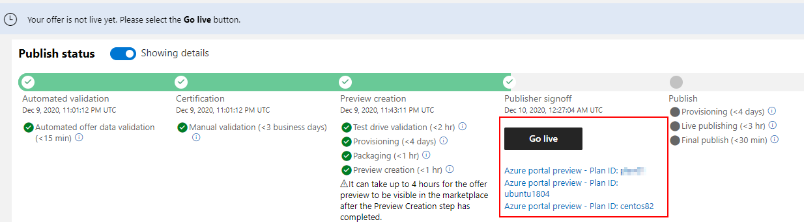

# Azure Virtual Machine (VM) Offer - Hello World Example (December 2020)

This repo contains a simple "Hello World" style example of Azure Virtual Machine offer that is used in a video tutorial.

## Create Azure VM Image

### Create Azure VM Image with Packer

* [VHD Destination](packer/packer-vhd.md)


* [Shared Image Gallery Destination](packer/packer-sig.md)


## Publish VM Offer in Azure Marketplace

<https://docs.microsoft.com/en-us/azure/marketplace/azure-vm-create>

## Test Preview VM Offer in Azure Marketplace

### Testing using Portal UI Deployment

Usually, after offer is fully ready in "preview", Partner Center provides special "preview" links that can be used to deploy the VM offer plans in the "Preview Audience" subscriptions via the <https://portal.azure.com/> user interface.



### Testing using Command Line Deployment

When deploying the preview image using portal user interface, the EULA/terms of the VM offer are automatically accepted and proper preview offer id is used. However, when deploying programmatically (i.e. CLI or template), we need to use proper xyz-preview offer id in the CLI command or ARM template and need to accept the terms programmatically.

While in "preview", the offer id provided during publishing is modified by appending **-preview** to the offer. For example, if the offer id is "test_arsenv_vm02", the preview offer id is "test_arsenv_vm02-preview".

In addition, "preview" offers and plans will not be visible via ```az vm image list --all --publisher YOUR_PUBLISHER``` command.

Create VM using Azure CLI by including proper publisher name, offer id, plan, and version (or latest) and including the marketplace VM offer required [**plan** properties](https://docs.microsoft.com/en-us/cli/azure/vm?view=azure-cli-latest#az_vm_create-optional-parameters).

```bash
# Create resource group for the test VM
az group create --name avtestvm300 --location eastus2

# Create test VM with public IP
az vm create --resource-group avtestvm300 --name avtestvm300 --admin-username azureuser --admin-password "Password@123" --image PUBLISHER_NAME:test_arsenv_vm02-preview:ubuntu1804_byol:latest --plan-publisher PUBLISHER_NAME --plan-product test_arsenv_vm02-preview --plan-name ubuntu1804_byol
```

### Accepting VM Offer EULA/Terms

The ```az vm create``` command above may give a warning like "Artifact: VMImage was not found" because image is in preview. In addition, it may complain about "EULA" offer terms not being accepted since this deployment is first one for our subscription and it is not happening via the portal UI that accepts terms implicitly. See related [blog post](https://arsenvlad.medium.com/azure-marketplace-api-to-programmatically-review-and-accept-publisher-agreement-eula-3066a6c143dd) about marketplace terms.

For fully published images we can use the built in command [az vm image terms accept](https://docs.microsoft.com/en-us/cli/azure/vm/image/terms?view=azure-cli-latest) to accept the terms, but it will not work for -preview images.

Instead, we check the preview image terms using ***REST API***

```bash
az rest --method get --url "/subscriptions/c9c8ae57-acdb-48a9-99f8-d57704f18dee/providers/Microsoft.MarketplaceOrdering/offertypes/virtualmachine/publishers/PUBLISHER_NAME/offers/test_arsenv_vm02-preview/plans/ubuntu1804/agreements/current?api-version=2015-06-01"
```

If the terms are not marked as accepted=true, we need to take the JSON output, change the "accepted":true in a JSON file and then do a REST PUT call:

```bash
az rest --method put --url "/subscriptions/c9c8ae57-acdb-48a9-99f8-d57704f18dee/providers/Microsoft.MarketplaceOrdering/offertypes/virtualmachine/publishers/PUBLISHER_NAME/offers/test_arsenv_vm02-preview/plans/ubuntu1804/agreements/current?api-version=2015-06-01" --body @terms.json
```

After terms are successfully accepted, we can re-try the ```az vm create``` command.
